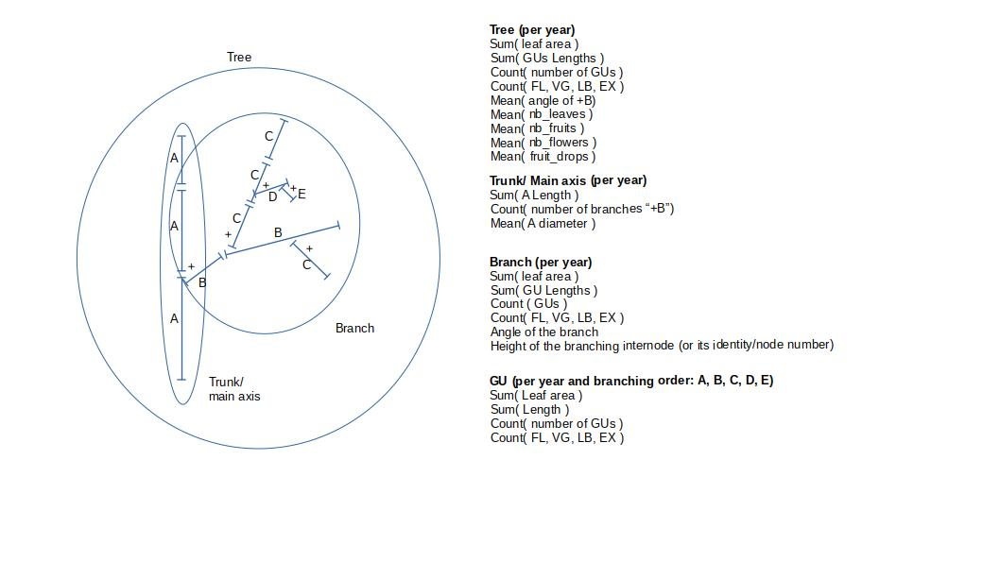

# GAFAM: Growing AgroForestry with Apple in Mediterranean climate

 

## Installation

conda install -c conda-forge -c openalea3 openalea.mtg pandas notebook ipython

## Data sets

This repository contains the architectural data of **45 apple trees** encoding as MTG.
The data set is loacated in [src/gafam/data](src/gafam/data) with asssociated Python package for automatic and simpler analysis.

## Analysis

Here is the variables that can be extracted

### Tree (per year)
- Sum( leaf area )
- Sum( GUs Lengths )
- Count( number of GUs )
- Count( FL, VG, LB, EX )
- Mean( angle of +B)
- Mean( nb_leaves )
- Mean( nb_fruits )
- Mean( nb_flowers )
- Mean( fruit_drops )

### Trunk/ Main axis (per year) (symbol A)
- Sum( A Length )
- Count( number of branches “+B”)
- Mean( A diameter )

### Branch (per year)
- Sum( leaf area )
- Sum( GU Lengths )
- Count ( GUs )
- Count( FL, VG, LB, EX )
- Angle of the branch
- Height of the branching internode (or its identity/node number)

### GU (per year and branching order: A, B, C, D)
- Sum( Leaf area )
- Sum( Length )
- Count( number of GUs )
- Count( FL, VG, LB, EX )

## Notebook for Reproducibility

